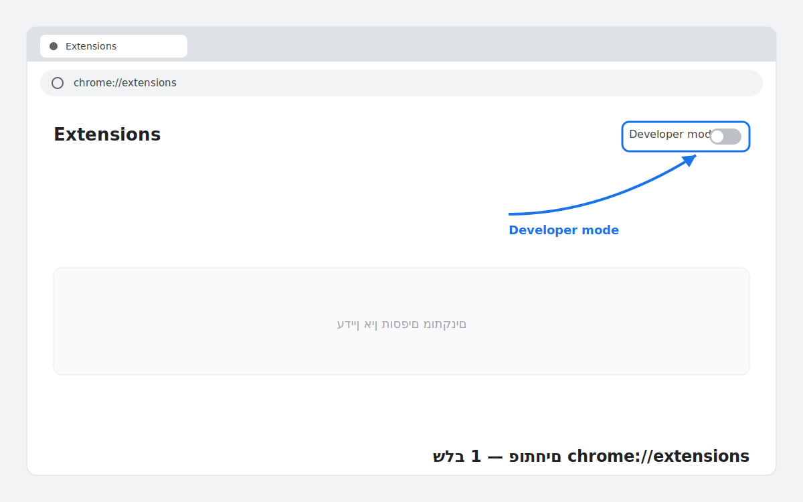
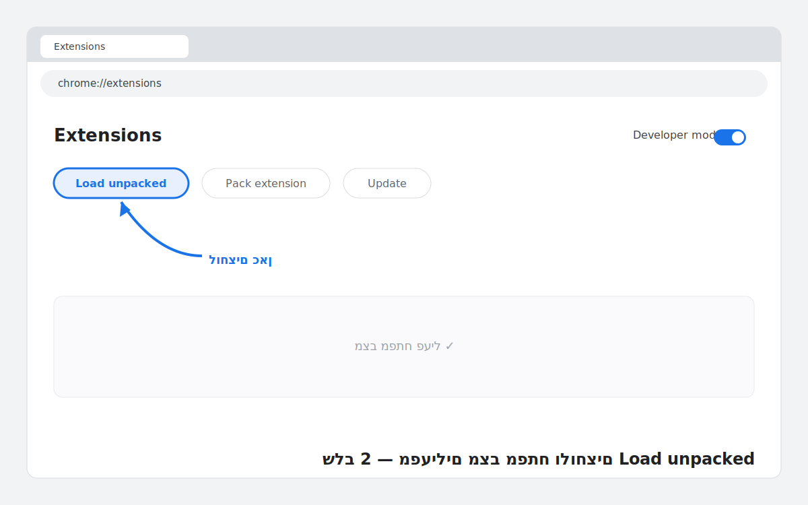
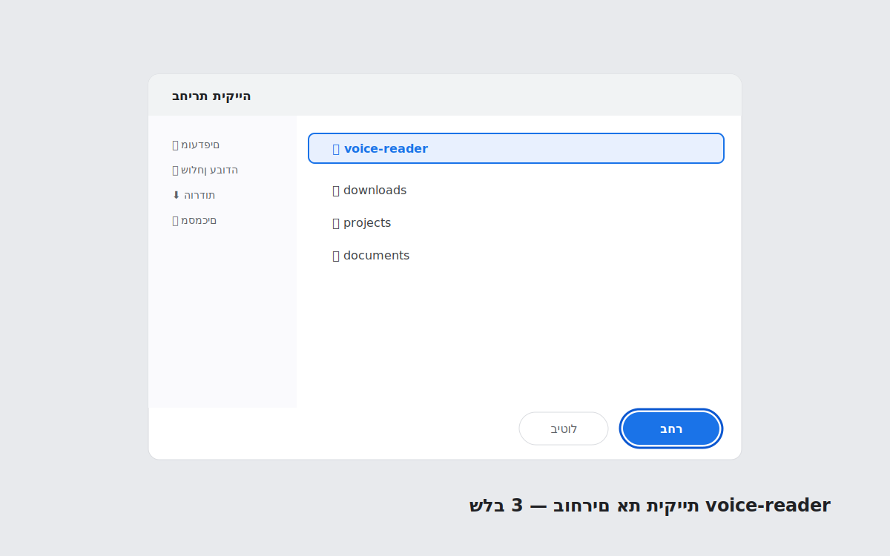
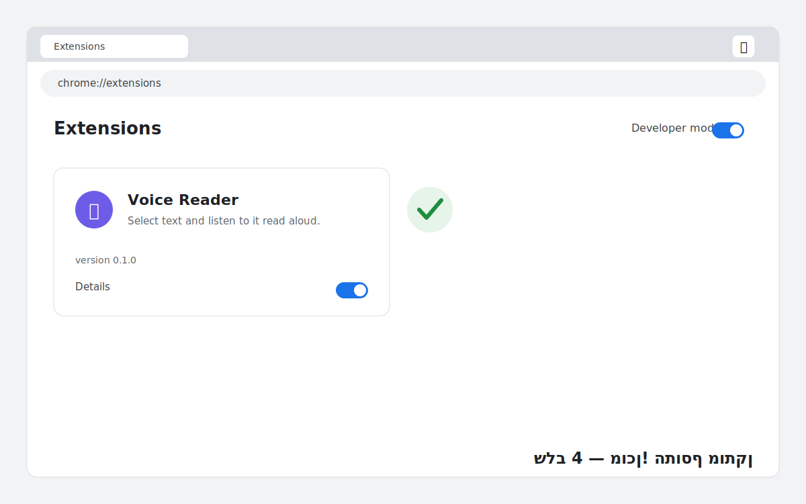

<div dir="rtl">

# התקנת Voice Reader 🔊

## מה זה התוסף?
תוסף לדפדפן שמקריא לך טקסט בקול. בוחרים טקסט בכל אתר, לוחצים קליק ימני — והתוסף מקריא אותו בקול נוירוני טבעי.
מקבלים **כתוביות מסונכרנות** (המילה הנקראת מודגשת), **מצב פוקוס** (רואים רק את המשפט הנוכחי), ו**שליטה במהירות** הקראה.
הכול רץ מקומי במחשב — בלי ענן, בלי חשבון, בלי מנוי.

---

## שלב א׳ — הורדה מ-GitHub ⬇️

**אפשרות 1 — הורדת ZIP (הכי פשוט):**
1. נכנסים לעמוד הפרויקט: https://github.com/romkakn/voice-reader
2. לוחצים על הכפתור הירוק **`Code`** ואז **`Download ZIP`**.
3. מחלצים (Extract) את הקובץ שירד. מקבלים תיקייה בשם `voice-reader`.
4. שמים את התיקייה במקום קבוע (למשל שולחן העבודה) — אל תמחקו אותה אחרי ההתקנה, הדפדפן טוען ממנה.

**אפשרות 2 — למי שמכיר git:**
```bash
git clone https://github.com/romkakn/voice-reader
```

---

## שלב ב׳ — התקנה ב-Chrome 🧩

### 1. פותחים את עמוד התוספים
בשורת הכתובת מקלידים `chrome://extensions` ולוחצים Enter.



### 2. מפעילים מצב מפתח ולוחצים Load unpacked
מדליקים את המתג **Developer mode** (פינה ימנית עליונה). נפתחת שורת כפתורים — לוחצים **`Load unpacked`**.



### 3. בוחרים את תיקיית voice-reader
בחלון שנפתח בוחרים את התיקייה `voice-reader` (זו שחילצתם) ולוחצים **בחר / Select**.



### 4. מוכן!
התוסף מופיע ברשימה עם השם **Voice Reader** וגרסה 0.1.0. אפשר להצמיד אותו לסרגל הכלים (אייקון הפאזל 🧩).



---

## עובד גם בדפדפנים אחרים 🌐
אותו תהליך בדיוק בכל דפדפן מבוסס Chromium — רק הכתובת משתנה:
| דפדפן | כתובת עמוד התוספים |
|---|---|
| Chrome | `chrome://extensions` |
| Edge | `edge://extensions` |
| Brave | `brave://extensions` |
| Opera | `opera://extensions` |

בכולם: מפעילים Developer mode → Load unpacked → בוחרים את התיקייה.

---

## איך משתמשים? ▶️
1. בוחרים (מסמנים) טקסט בכל עמוד.
2. קליק ימני → **`Voice Read`** → בוחרים מצב:
   - **Explanatory** — קול ברור ושקול, מתאים ללמידה.
   - **Storytelling** — קול מלא הבעה, מתאים לסיפור/כתבה.
3. נפתח **סרגל צף** עם: נגן/השהה, מהירות (−/+), כתוביות (CC), הגדרות (גלגל שיניים), וסגירה.
4. הסרגל נשאר פתוח — אפשר לסמן טקסט חדש וללחוץ ▶ כדי להקריא אותו בלי תפריט.
5. בכתוביות החיות: לוחצים על משפט כדי להקריא ממנו מחדש. כפתור הפוקוס (◎) מציג רק את המשפט הנוכחי, גדול וממורכז.

---

## הורדת קול נוירוני (פעם אחת) 📥
בקריאה הראשונה התוסף מוריד את מודל הקול (~63–75MB) מ-HuggingFace. זה קורה **פעם אחת בלבד** ונשמר במחשב.
אחרי זה הכול עובד **אופליין**, מהיר ובלי אינטרנט.

---

## פתרון בעיות 🛠️
- **התוסף לא מופיע / לא עובד באתר פתוח** → חוזרים ל-`chrome://extensions`, לוחצים על אייקון הרענון בכרטיס התוסף. ודאו שבחרתם את התיקייה הנכונה (זו שמכילה את `manifest.json`).
- **אין קול** → ודאו שהטאב לא מושתק (אייקון רמקול בטאב), ושהמהירות בסרגל לא ירדה ל-0.
- **הקריאה תקועה על "טוען"** → בפעם הראשונה זו הורדת מודל הקול — מחכים שתסתיים (תלוי במהירות האינטרנט).

</div>
